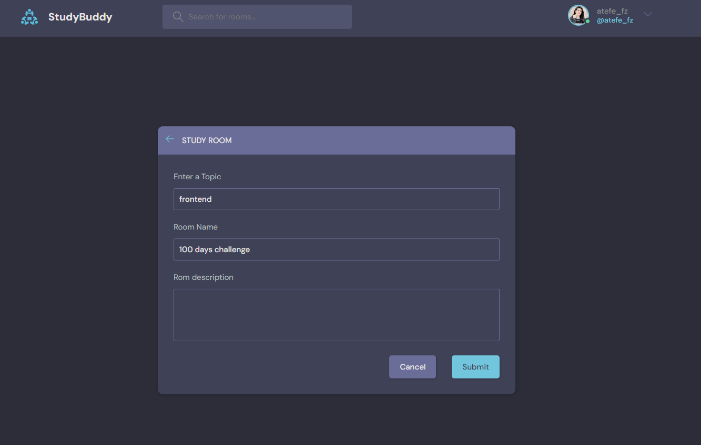
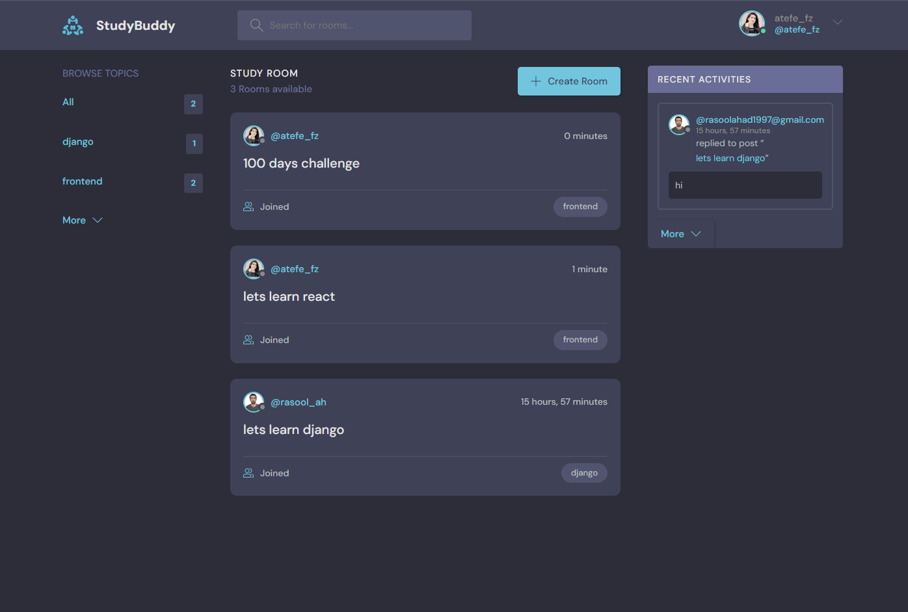
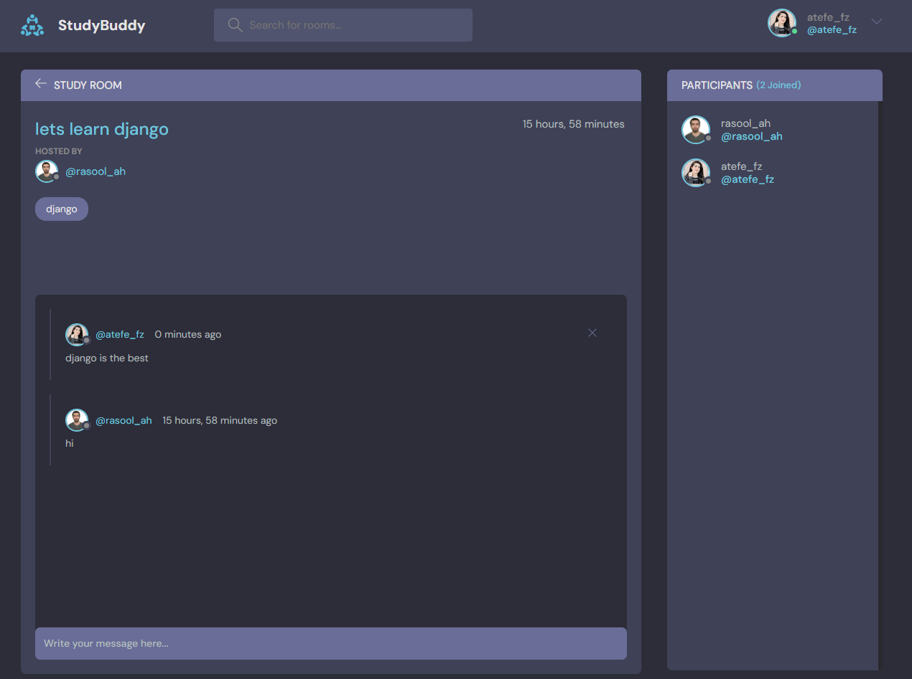
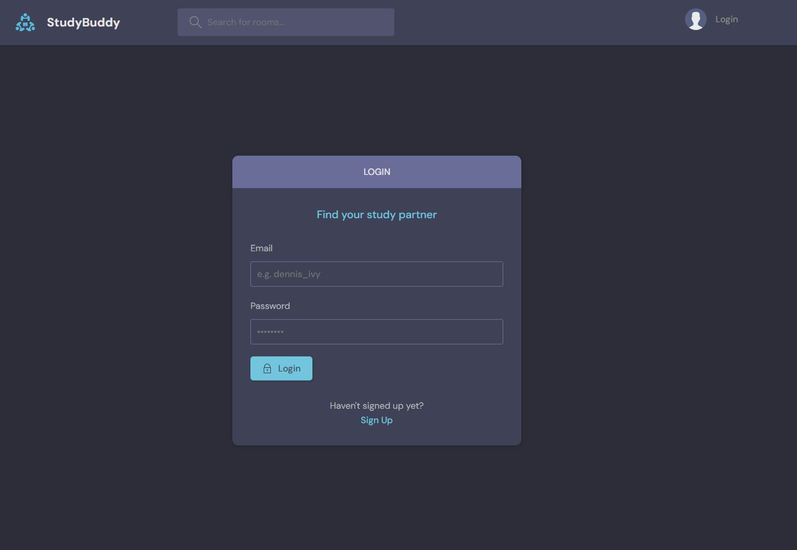

## study bodies website 

This Website created for practice django.
in this website you can learn programing languages with your studdy bodies :)
## Table of Contents
1. [Project Overview](#project-overview)
2. [Features](#features)
3. [Installation](#installation)
4. [Usage](#usage)
5. [Contributing](#contributing)
6. [License](#license)

---

## Project Overview
Study Bodies is a collaborative learning platform designed to facilitate knowledge sharing and discussions on a wide range of topics. Users can register, create posts, and engage in real-time chats with other members. Whether you're a student looking for study resources or an expert eager to share your knowledge, Study Bodies provides a dynamic space for learning and connecting.
here is some screen shots: 




## Features

* **User Authentication and Registration:** Securely register and log in using email or social media accounts.

* **Post Creation and Management:** Easily create, edit, and delete posts categorized by topics.

* **Discussion Forum:** Engage in discussions, share insights, and explore a wide array of subjects.

* **Chat:** Communicate with other users in real-time, fostering a sense of community.

* **Profile Management:** Customize your profile, add profile pictures, and showcase your expertise.

* **Search and Filtering:** Effortlessly find posts and topics based on keywords or categories.
## Installation


1. Clone the repository:
   ```
   git clone https://github.com/username/project.git
   ```

2. Create a virtual environment and activate it:
   ```
   python -m venv venv
   source venv/bin/activate   # On Windows, use: venv\Scripts\activate
   ```

3. Install the project dependencies:
   ```
   pip install -r requirements.txt
   ```

4. Apply migrations and create a superuser:
   ```
   python manage.py migrate
   python manage.py createsuperuser
   ```

## Usage


1. Start the development server:
   ```
   python manage.py runserver
   ```

2. Open a web browser and go to `http://localhost:8000/`.

## Contributing

- If you find a bug, please open an issue with a detailed description.
- If you have a feature request, feel free to create an issue and discuss it.
- Contributions via pull requests are welcome.
